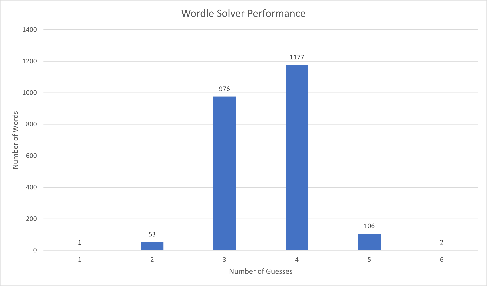

# Wordle Solver

Implementation and solver of the word-game phenomenon.

## Game Interface

usage: wordle.py [-h] [--manual] [--seed SEED]

| Syntax | Description |
| ----------- | ----------- |
| -h, --help   | show this help message and exit |
| --manual     | play manually |
| --seed SEED  | seed word |

Providing no flags will have the solver attempt every possible word.\
Providing the seed flag by itself will have the solver attempt to solve the given seed.\
Providing the manual flag (with or without a seed word) will present the user with an interactive game of wordle.
## Algorithm
This solver uses a minimax-approach inspired by [Knuth's mastermind algorithm](http://www.cs.uni.edu/~wallingf/teaching/cs3530/resources/knuth-mastermind.pdf). The solver's guess at each stage is the word which would *minimize the maximum number of remaining possibilities*. This is, of course, quite slow when there are many remaining possible words; for a single game of wordle, ~10 seconds on my local machine. We improve performance by caching suggestion results to disk, resulting in being able to solve all possible games in ~25 seconds on the same machine.

## Performance (starting word "arise")

